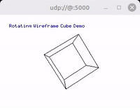

# TinyGPU

[](https://www.arduino.cc/reference/en/libraries/)
[](https://opensource.org/licenses/Apache-2.0)

TinyGPU is a lightweight Arduino graphics library for RGB565 bitmap surfaces, sprites, and simple 3D wireframe rendering.



RGB565 is a compact 16-bit color format that stores red in 5 bits, green in 6 bits, and blue in 5 bits. It is widely used by small TFT, LCD, OLED, and other embedded display controllers because it needs much less memory and bandwidth than 24-bit RGB while still providing good visual quality for many graphics applications.

Apart form RGB565 we also support RGB666, RGB888 and Monochrome.

## Features

- RGB565, RGB666, RGB888 and Monochrome color 
- In-memory bitmap surfaces
- Basic drawing primitives
  - pixels
  - lines
  - rectangles
  - circles
- Bitmap font rendering
- Wrapped line printing
- Sprite drawing and sprite-aware framebuffer management
  - add
  - move
  - scale
  - rotate
- Basic 3D wireframe rendering
  - transforms
  - camera / view matrix
  - perspective and orthographic projection
  - minimal depth-buffered line rendering
- BMP file support
  - saving data
  - loading data
- Arduino example sketches

## Overview

TinyGPU is designed as a small in-memory rendering layer that stays independent from any specific display driver. You render into RGB565 memory first and then forward the resulting pixel data to your own hardware-specific output code.

The library covers three main areas:

- 2D drawing and text rendering for compact embedded displays
- sprite-oriented composition and transforms for UI and simple animation
- lightweight 3D wireframe rendering for visualizations and demos


## Documentaion

- [Class Documentation](https://pschatzmann.github.io/TinyGPU/namespacetinygpu.html)
- [Wiki](https://github.com/pschatzmann/TinyGPU/wiki)
- [Examples](examples)


## Installation

For Arduino, you can download the library as zip and call include Library -> zip library. Or you can git clone this project into the Arduino libraries folder e.g. with

```
cd  ~/Documents/Arduino/libraries
git clone https://github.com/pschatzmann/TinyGPU.git
```